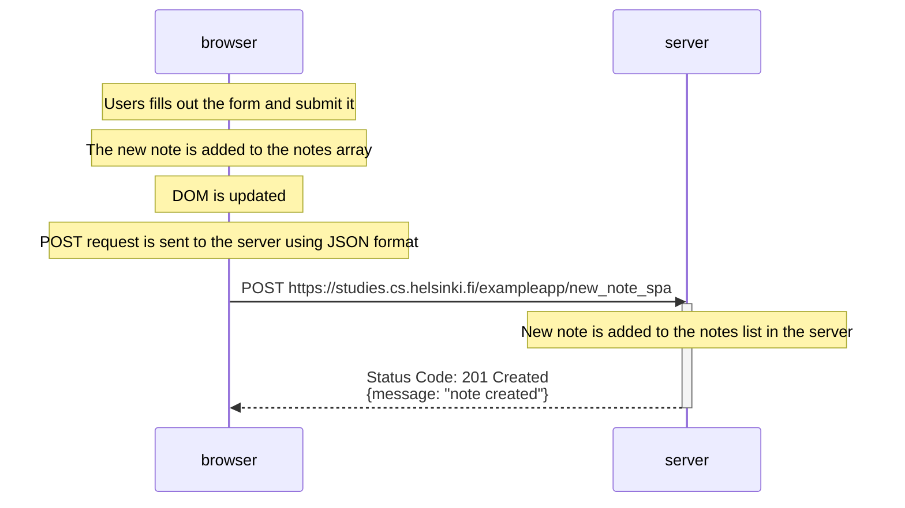

```mermaid
sequenceDiagram
    participant browser
    participant server

    Note over browser: Users fills out the form and submit it
    Note over browser: The new note is added to the notes array
    Note over browser: DOM is updated
    Note over browser: POST request is sent to the server using JSON format

    browser->>server: POST https://studies.cs.helsinki.fi/exampleapp/new_note_spa
    activate server
    Note over server: New note is added to the notes list in the server
    server-->>browser: Status Code: 201 Created <br> {message: "note created"}
    deactivate server
```